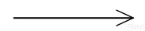
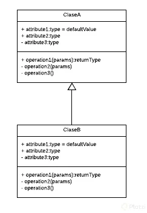
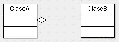

# 7_Curso_de_Programacion_Orientada_a_objetos_POO

**Curso Platzi de Programación Orientada a Objetos**

**List**

- [¿Porqué Aprender Programación Orientada a Objetos?](#¿porqué-aprender-programación-orientada-a-objetos)
- [¿Qué Resuelve la Programación Orientada a Objetos?](#¿qué-resuelve-la-programación-orientada-a-objetos)
- [Paradigma Orientado a Objetos](#paradigma-orientado-a-objetos)
- [Lenguajes Orientados a Objetos](#lenguajes-orientados-a-objetos)

# ¿Porqué Aprender Programación Orientada a Objetos?

* **Vas a programar más rápido**. Tener un análisis previo de lo que estás realizando te ayudará a generar código mucho más veloz 

* **Dejas de ser Programador Jr**.  Podrás responder preguntas como ¿qué es encapsulamiento?, ¿Qué es abstracción?, ¿Qué es herencia?, ¿Qué es polimorfismo? en futuras entrevistas de trabajo. 

* **Deejar de copiar y pegar código**

La programación orientada a objetos tiene cuatro características principales:

* **Encapsulamiento**. Quiere decir que oculta datos mediante código.

* **Abstracción**. Es como se pueden representar los objetos en modo de código.

* **Herencia**. Es donde una clase nueva se crea a partir de una clase existente.

* **Polimorfismo**. Se refiere a la propiedad por la que es posible enviar mensajes sintácticamente iguales a objetos de tipos distintos.

En este curso, los pasos a seguir será.

* *Analisis*
    * Observación
    * Entendimiento
    * Lectura
* *Plasmar*
    * Diagramas
* *Programar*
    * Lenguajes de Programación

# ¿Qué Resuelve la Programación Orientada a Objetos?

La programación Orientada a Objetos nace de los problemas creados por la programación estructurada y nos ayuda a resolver cierto problemas como:

* **Código muy largo**: A medida que un sistema va creciendo y se hace más robusta el código generado se vuelve muy extenso haciéndose difícil de leer, depurar, mantener.

* **Si algo falla, todo se rompe**: Ya que con la programación estructurada el código se ejecuta secuencialmente al momento de que una de esas líneas fallara todo lo demás deja de funcionar.

* **Difícil de mantener**.En este caso, entra el código spaguetti, una serie de condicionales anidados que engrosan el programa.

# Paradigma Orientado a Objetos 

La Programación Orientada a Objetos viene de una filosofía o forma de pensar que es la Orientación a Objetos y esto surge a partir de los problemas que necesitamos plasmar en código.

Es analizar un problema en forma de objetos para después llevarlo a código, eso es la Orientación a Objetos.

Un paradigma es una teoría que suministra la base y modelo para resolver problemas. La paradigma de Programación Orientada a Objetos se compone de 4 elementos:

* Clases
* Propiedades
* Métodos
* Objetos

Y 4 Pilares:

* Encapsulamiento
* Abstracción
* Herencia
* Polimorfismo

# Lenguajes Orientados a Objetos 

Algunos de los lenguajes de programación Orientados a Objetos son:

* Java:
    - Orientado a Objetos naturalmente
    - Es muy útilizado en Android
    - Y es usado del lado del servidor o Server Side
* PHP
    - Lenguaje interpretado
    - Pensado para la Web
* Python
    - Diseñado para ser fácil de usar
    - Múltiples usos: Web, Server Side, Análisis de Datos, Machine Learning, etc
* Javascript
    - Lenguaje interpretado
    - Orientado a Objetos pero basado en prototipos
    - Pensado para la Web
* C#
* Ruby
* Kotlin

# Diagramas de Modelado 

* **OMT**: Object Modeling Techniques. Es una metodolosía para el análisis orientado a objetos. 
* **UML**: Unified Modeling Language o Lenguaje de Modelado Unificado. Tomó las bases y técnicas de OMT unificándolas. Tenemos más opciones de diagramas como lo son Clases, Casos de Uso, Objetos, Actividades, Iteración, Estados, Implementación. 

# ¿Qué es UML?

UML Significa **Unified Modeling Language**, el cual es un lenguaje estándar de modelado de sistemas orentados a objetos. 

Esto significa que se puede obtener una manera gráfica de representar una situación. A continuación se presentan los elementos que se pueden utilizar para hacer estas representaciones. 

Las **Clases** se representan así, 

En la parte superior se colocan los atributos o propiedades, y debajo las operaciones de la clase. El primer caracter con el que empiezan es un símbolo. Este denotará la visibilidad del atributo o método, esto es un término que tiene que ver con Encapsulamiento.

Los niveles de visibilidad son: 

* (-) private
* (+) public
* (#) protected
* (~) default

Una forma de representar las relaciones que tendrá un elemento con otro es através de las flechas en UML, existen varios tipos, estos son los más comunes: 

**Asociación**

Como su nombre lo indica, significa que cada vez que esté referenciada este tipo de flecha, ese elemento contiene al otro en su definición. La flecha apunta hacia su dependencia. 

Por lo tanto, en la figura se muestra que la Clase A está asociada y depende de la Clase B 

**Herencia**

Con este tipo de flecja se está expresando la herencia. La dirección va desde el hijo hasta el padre 

La figura muestra que la Clase B hereda de la Clase A

**Agregación**

Este se parece a la asociación en que un elemento  dependerá del otro, pero en este caso será: Un elemento dependerá de muchos otros. Aquí tomamos como referencia la multiplicidad del elemento. Lo que comúnmente se conocería en Bases de Datos como Relaciones uno a Muchos. 

La Clase A contiene varios elementos de la Clase B. Estos últimos son comúnmente representados con listas o colecciones de datos. 

**Composición** 

Es similar al anterior, sólo que su relación es totalmente compenetrada de tal modo que conceptualmente una de estas clases no podría vivir si no existiera la otra. 

# Objetos 

Los objetos son aquellos que tienen propiedades y comportamientos, también serán sustantivos. 

* Pueden ser físicos o conceptuales

Las **propiedades** también pueden llamarse atributos y estos también serán sustantivos. Algunos atributos o propiedades son nombre, tamaño, forma, estado, etc. Son todas las caraterísticas del objeto. 

Los **comportamientos** serán todas las operaciones que el objeto puede hacer, suelen ser verbos o sustantivos y verbo. Algunos ejemplos pueden ser que el usuario pueda hacer login y logout.

# Abstracción y Clases 

Ahora el concepto se aumenta cuando todo esto se ve como una sola cosa llamada Clase.

Una Clase Es el modelo sobre el cual nuestros objetos se construyen.

Es decir si tenemos un objeto llamado perro y este tiene sus atributos que lo describen generalmente y a su vez tiene métodos donde se define las acciones que pueda hacer ese perrito. Una clase me permite generar más objetos (más perros) con mismos atributos y métodos pero con resultados diferentes. ej:

Objeto #1 llamado “Rocky”:
atributo_1: color = marron
atributo_2: tamano = pequeno
atributo_3: raza = chiguagua

metodo_1: ladrar
metodo_2: comer
metodo_3: dormir

Objeto #2 llamado "Max"
atributo_1: color = blanco
atributo_2: tamano = grande
atributo_3: raza = hunky siberiano

metodo_1: ladrar
metodo_2: comer
metodo_3: dormir

Para no repetir esto muchas veces de acuerdo a la cantidad de perros que es mi ejemplo de objeto, la idea es analizar todos estos objetos extraemos todos esos atributos y entonces generamos modelos. Esos modelos se le llaman Clases.

Una Clase son los modelos sobre los cuales construiremos Objetos

A este análisis se le conoce como Abstracción, simplemente consiste en generar un molde en base a esas propiedades y métodos de los objetos, abstraemos todos esos datos para generar dicho molde.

Resumen: Una clase es un molde para generar un objeto y este análisis se llama Abstracción

# Modularidad 

La **modularidad** va muy relacionada con las clases y es un principio de la Programación Orientada a Objetos y va de la mano con el Diseño Modular que significa dividir un sistema en partes pequeñas y estas serán nuestros módulos pudiendo funcionar de manera independiente. 

La **modularidad** de nuestro código nos va a permitir 

* Reutilizar 
* Evitar colapsos 
* Hacer nuestro código más mantenible
* Legibilidad
* Resolución rápida de Problemas

Una buena práctica es separando las clases en archivos diferentes

